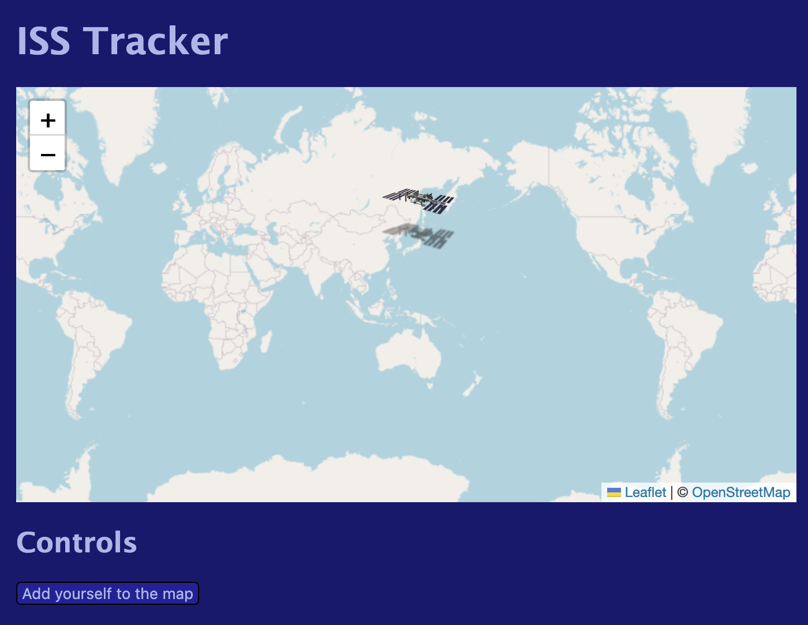

# ISS Tracker



Track the location of the Interational Space Station in real time!

- [View live website!](https://j0lol.github.io/iss-tracker/)

## Technologies used

- [Where the ISS at?](http://wheretheiss.at/) API for finding the location of the ISS
- [Leaflet](https://leafletjs.com/) and [OpenStreetMap](https://www.openstreetmap.org/) for the live map view
- [Geolocation API](https://developer.mozilla.org/en-US/docs/Web/API/Geolocation_API) for finding the user's location

## Setup

1. Run a basic HTTP Server

```
cd iss-tracker

# For example, run a Python server:
python3 -m http.server 3000
```

2. Navigate to http://localhost:3000
